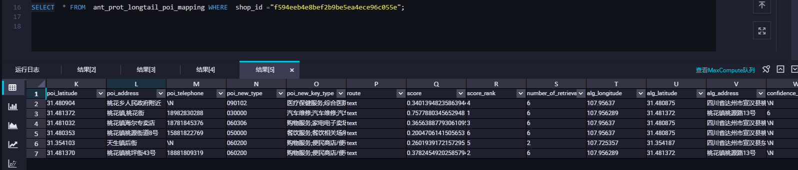
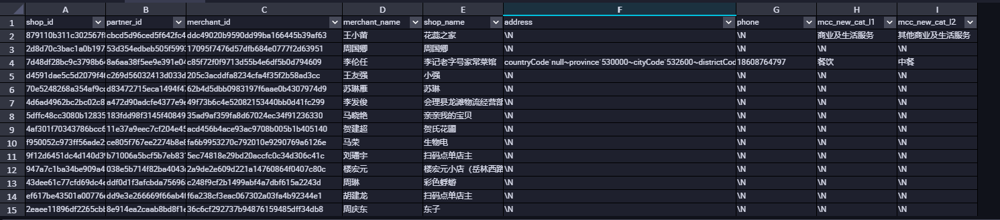

# 创建表

## -- 基本语法

```sql
CREATE TABLE IF NOT EXISTS ant_prot_dev.mt_test(
    link_id STRING PRIMARY KEY,
    fnode_id STRING,
    fnode_longitude STRING,
    fnode_latitude STRING,
    tnode_id STRING,
    tnode_longitude STRING,
    tnode_latitude STRING,
    link_len STRING,
    direction STRING) 
    STORED AS ALIORC TBLPROPERTIES ('lifecycle'='90');
```

## -- 创建新表从一个表的某几列

```sql
CREATE TABLE IF NOT EXISTS mt_test123 AS
SELECT fnode_id,tnode_id FROM  mt_test1 AS A1;
```

## -- 创建新表从不同表的其他列

```sql
-- 创建新表从不同表的其他列
CREATE TABLE IF NOT EXISTS mt_test1234 AS
-- 将不同表的其他列 JOIN 到一起(通过ROW_NUMBER增加的索引列) 
SELECT  t1.link_id,
        t2.link_id2,
        t1.nums
FROM    
    (SELECT link_id
            , ROW_NUMBER() OVER () AS nums
        FROM mt_test1) AS t1
        JOIN  
    (SELECT link_id AS link_id2
            , ROW_NUMBER() OVER () AS nums
        FROM mt_test1) AS t2 ON t1.nums = t2.nums; 
SELECT * FROM mt_test1234;
```

# 修改表的结构

## -- 添加新的列 覆盖原来的表给新的列赋值

```sql
-- 添加新的列 覆盖原来的表给新的列赋值
ALTER  TABLE  mt_test1 ADD COLUMNS  (test_col string);

INSERT OVERWRITE TABLE mt_test1
    SELECT 
        link_id,
        fnode_id ,
        f_loc  ,
        fnode_longitude ,
        fnode_latitude ,
        tnode_id ,
        t_loc  ,
        tnode_longitude ,
        tnode_latitude ,
        link_len ,
        direction ,
        CONCAT(link_id, '#', tnode_id, '#', link_len)  AS test_col
        FROM  mt_test1;

SELECT  * 
FROM  mt_test1;
```


```sql
--1 
SET odps.instance.priority = 0;
SELECT fnode_id, fnode_longitude,fnode_latitude, tnode_id, tnode_longitude, tnode_latitude, link_len, alipaydw:UDFLBSGridExpand (fnode_latitude,fnode_longitude,3,1) AS grid_round_id
        FROM ant_prot_road_link_info LIMIT 1;
```


```sql
--2
SELECT TRANS_ARRAY(7,'#',fnode_id, fnode_longitude,fnode_latitude, tnode_id, tnode_longitude, tnode_latitude, link_len, grid_round_id) 
    AS (fnode_id, fnode_longitude,fnode_latitude, tnode_id, tnode_longitude, tnode_latitude, link_len, grid_id) FROM 
    (
        SELECT fnode_id, fnode_longitude,fnode_latitude, tnode_id, tnode_longitude, tnode_latitude, link_len, alipaydw:UDFLBSGridExpand (fnode_latitude,fnode_longitude,3,1) AS grid_round_id
        FROM ant_prot_road_link_info
    ) T1;
```


# 门店真实性判断

## ant_prot_longtail_poi_mapping  poi表


(1 2)shop                  

(8-15 16 17 18 19)poi        number_of_retrieval 和score_rank     

(20-24)alg



## ant_prot_longtail_shop  长尾门店表




{
    countryCode: null,
    province: 450000,
    cityCode: 450900,
    districtCode: 450922,
    detailAddress: 马坡镇东西村27号,
    longitude: 110.23888,
    latitude: 22.518945,
    poiid: null,
    zipCode: null,
    cityName: 玉林市,
    provinceName: 广西壮族自治区,
    districtName: 陆川县
}


## ant_prot_poi_info  长尾门店-poi的挂载映射表


23 24   ~~25-43~~

45-51 alias多为空

52-57 多为空